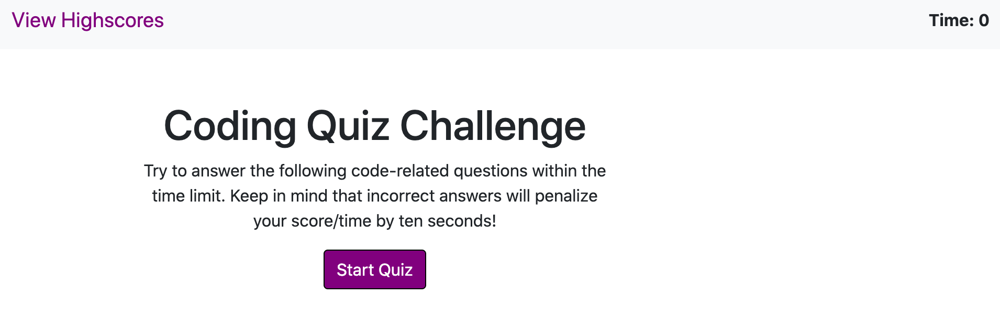
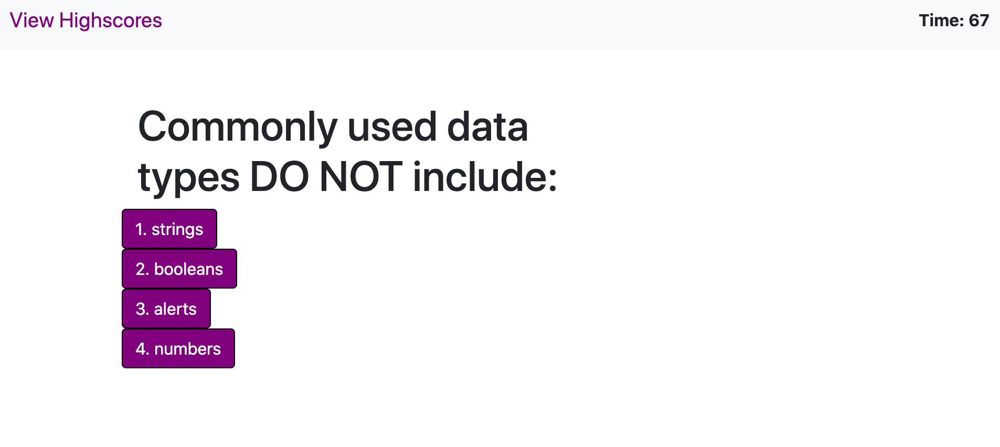
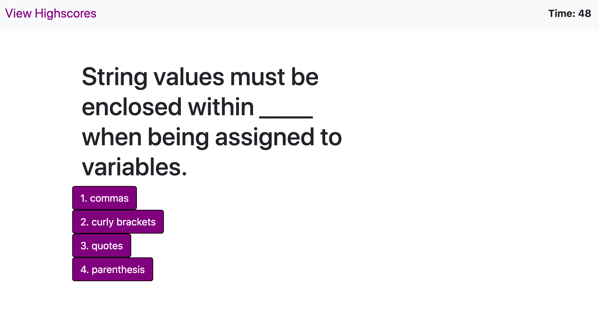
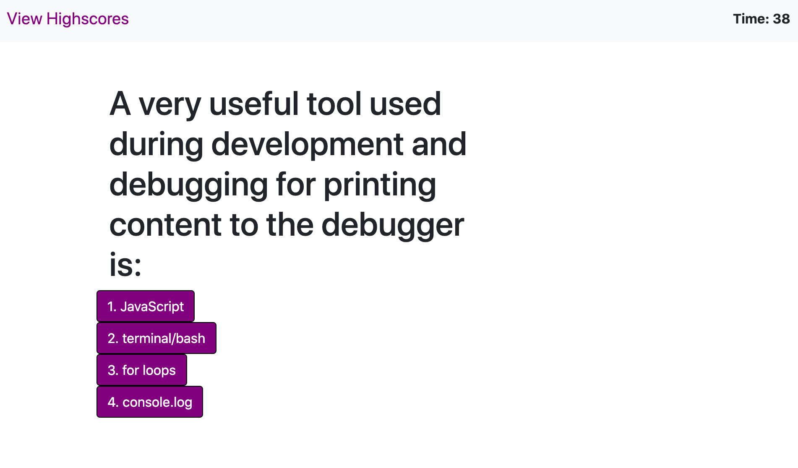
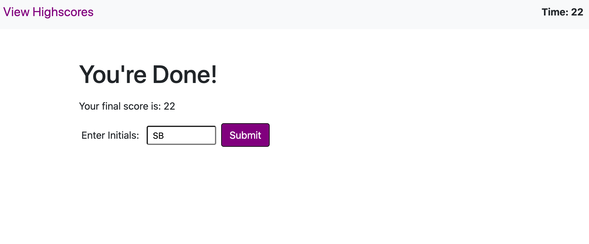
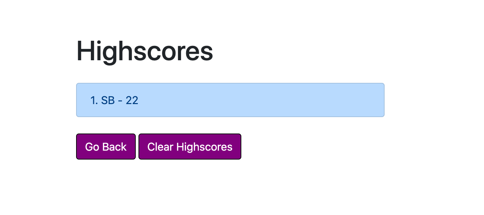

# Webdev-code-quiz

This assignment was intended to push my boundaries within Javascript and manipulating the DOM. I am still building confidence in writing Javascript and knowing its correct syntax but the problem solving and research has been frustrating but enjoyable. I started this assignment by first creating the initial index.html , style.css , and script.js files and linking them together. Next I added my bootstrap cdn to the index.html and started writing out the body of my homepage. After the initial write up, I went over to the script.js file and began naming my DOM variables as well as my javascript variables. I proceeded to start writing my initial functions to get the quiz started but ran into the problem of not having the question show when transitioning to the first question. I could see the different options but not the question. Figure this out took me the longest but after discussing with classmates and googling, I was able to figure it out. I had to refracture my index.html and script.js files a few times to get them to properly flow and work in the way the webpage was intended. 
    My next issue came after setting up the highscores.html and highscores.js. Getting the function for the .js file was a bit of struggle but fine. The issue came on getting the buttons to work. I think primarily because I had been working on it for so long but getting the correct code in and being able to clear the high scores on the local storage and the webpage it self by using the parents was something I had not considered until well into my research. 
    My final problem I ran into was when I thought I had completed the assignment and then realized that when the timer ran out, the quiz just stopped and did not take the user to the score page. Thankfully with some quick searching and trial and error, I was able to get the timer to get to zero, give the user a score of zero and send the user to the score page. 
## Installation

Fork repository at [gstephbolivar github](https://gstephbolivar.github.io/webdev-code-quiz/) .

Clone repository to local terminal.

Open HTML then open webpage to default browser.

Happy editing!

## Usage
This [website] (https://gstephboli.github.io/webdev-code-quiz/) test a user's basic knowledge of Javascript. The user has 75 seconds to complete the quiz, if time runs out the test ends and their score is zero. For every wrong answer, the user loses 10 seconds on the clock. At the end of the quiz, the user can input their score and save it in the high score page, otherwise they can either clear the high score history or go back to the main quiz page. 

## Credits

I credit the following websites:

[Manuela] (https://github.com/manucaicedo) for general knowledge and guidance. 

[Bootstrap] (https://getbootstrap.com/) for the buttons and specific margins,etc specifications used to format the layout of this page. 

[JavascriptTutorial] (https://www.javascripttutorial.net/dom/manipulating/remove-all-child-nodes/?fbclid=IwAR12leFq1Scnw05YLPRP5Y625TS3xP0BpUttVH4ohJbqGZv53lGpBTYrv10) for helping me figure out how to clear out the high scores. 

[LogRocket] (https://blog.logrocket.com/the-complete-guide-to-using-localstorage-in-javascript-apps-ba44edb53a36/#:~:text=localStorage%20in%20JavaScript%3A%20How%20to&text=setItem()%20%3A%20Add%20key%20and,clear()%20%3A%20Clear%20all%20localStorage) for help with clearing my local storage when hitting clear highscore button.

[StackOverflow] (https://stackoverflow.com/questions/37802456/call-a-function-when-my-timer-reaches-zero) Getting me on the right path for when the timer reaches zero, sending user to the score page. 

[StackOverflow] (https://stackoverflow.com/questions/9456289/how-to-make-a-div-visible-and-invisible-with-javascript?fbclid=IwAR0RjdTjoo23K-PUIdloxf3-MbZXgtQklGMaVuorVT2oeVJtlwJUokJgDtI) Helping me hide and show the score page message and input information. 

## Contact

####  **Stephany Bolivar** 
*  **Github:** [@gstephbolivar](https://github.com/gstephbolivar)
*  **Email:** [g.stephanybolivar@gmail.com](g.stephanybolivar@gmail.com)

## License

MIT License

Copyright (c) [2020] [Gloria Stephany Bolivar]

Permission is hereby granted, free of charge, to any person obtaining a copy
of this software and associated documentation files (the "Software"), to deal
in the Software without restriction, including without limitation the rights
to use, copy, modify, merge, publish, distribute, sublicense, and/or sell
copies of the Software, and to permit persons to whom the Software is
furnished to do so, subject to the following conditions:

The above copyright notice and this permission notice shall be included in all
copies or substantial portions of the Software.

THE SOFTWARE IS PROVIDED "AS IS", WITHOUT WARRANTY OF ANY KIND, EXPRESS OR
IMPLIED, INCLUDING BUT NOT LIMITED TO THE WARRANTIES OF MERCHANTABILITY,
FITNESS FOR A PARTICULAR PURPOSE AND NONINFRINGEMENT. IN NO EVENT SHALL THE
AUTHORS OR COPYRIGHT HOLDERS BE LIABLE FOR ANY CLAIM, DAMAGES OR OTHER
LIABILITY, WHETHER IN AN ACTION OF CONTRACT, TORT OR OTHERWISE, ARISING FROM,
OUT OF OR IN CONNECTION WITH THE SOFTWARE OR THE USE OR OTHER DEALINGS IN THE
SOFTWARE.